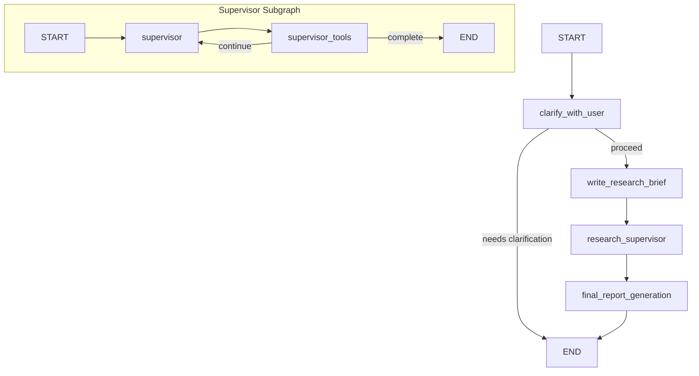

# Open Deep Research — Engineering Due Diligence Report

**Repository**: [langchain-ai/open_deep_research](https://github.com/langchain-ai/open_deep_research)
**Clone**: `git clone https://github.com/langchain-ai/open_deep_research.git` into `./repo_clone`
**Date of Analysis**: 2026-06-13
**Commit Analyzed**: HEAD (latest on `main`)

---

## 1. Executive Summary

Open Deep Research is a LangGraph-based multi-agent system for automated deep research and report generation. The system employs a **three-level nested StateGraph architecture**: a main graph orchestrates clarification, research brief generation, subgraph-based research supervision, and final report synthesis. The supervisor subgraph delegates to parallel researcher subgraphs that execute search tool calls and compress findings.

The codebase is **well-structured for its purpose** — clean module boundaries, consistent async patterns, thoughtful use of structured outputs with retry logic, and broad model provider support via LangChain's `init_chat_model()`. However, it exhibits **significant production-readiness gaps**: no unit tests, no CI/CD pipeline, minimal error observability, no rate-limiting or caching, broad `except Exception` catch blocks, and a critical logical bug (`or True` at line 334). The 2,511-line total source (including 925-line `utils.py`) is concentrated in a few files, and the legacy folder adds ~3,000 more lines of dead code in the same package.

**Bottom line**: Excellent research prototype and reference architecture. Not production-ready without substantial investment in testing, observability, error handling, and operational infrastructure.

---

## 2. Repository Overview

### File Inventory (Core Package)

| File | Lines | Role |
|------|-------|------|
| `src/open_deep_research/deep_researcher.py` | 718 | Main graph definition — all nodes, subgraph construction, compilation |
| `src/open_deep_research/configuration.py` | 251 | Pydantic `Configuration` model, `SearchAPI` enum, `MCPConfig` |
| `src/open_deep_research/prompts.py` | 367 | All system prompts — clarify, research_brief, supervisor, researcher, compression, final report |
| `src/open_deep_research/state.py` | 95 | Pydantic structured output models + TypedDict state definitions |
| `src/open_deep_research/utils.py` | 925 | Tool implementations, MCP auth, token limit detection, API key resolution |
| `src/security/auth.py` | 155 | LangGraph `Auth` middleware with Supabase JWT verification |
| `tests/` (7 files) | ~500 | Evaluation scripts (LangSmith evaluators, benchmarks) — **no unit tests** |

### Legacy Code
| `src/legacy/` | ~3,000 | Two older implementations (plan-and-execute `graph.py`, multi-agent `multi_agent.py`) |

### Key Configuration Files
- `pyproject.toml` — project metadata, dependencies, build config, `ruff` linting rules (lines 1-90)
- `langgraph.json` — LangGraph deployment config: entry point is `deep_researcher` graph at `deep_researcher.py:deep_researcher` (lines 1-17)
- `.github/workflows/claude.yml` — Claude AI code review on issues/PRs (not automated CI)
- `.github/workflows/claude-code-review.yml` — Claude PR review bot (not automated CI)

---

## 3. Architecture Deep Dive

### 3.1 Three-Level Nested StateGraph Architecture

The system uses LangGraph's `StateGraph` with three composition levels:



Evidence: `deep_researcher.py`, lines 701-719 (main graph construction), lines 589-605 (researcher subgraph), lines 353-363 (supervisor subgraph).

### 3.2 State Definitions

- **`AgentInputState`** (state.py:62): wraps `MessagesState` — only carries `messages`
- **`AgentState`** (state.py:65): extends `MessagesState` with `supervisor_messages`, `research_brief`, `raw_notes`, `notes`, `final_report`
- **`SupervisorState`** (state.py:74-89): `TypedDict` with `supervisor_messages`, `research_brief`, `notes`, `research_iterations`, `raw_notes`
- **`ResearcherState`** (state.py:83-90): `TypedDict` with `researcher_messages`, `tool_call_iterations`, `research_topic`, `compressed_research`, `raw_notes`
- **`ResearcherOutputState`** (state.py:92-95): Pydantic output model for researcher subgraph results

Key design choice: `SupervisorState` and `ResearcherState` are **TypedDicts** with no runtime validation, while `AgentState` uses `MessagesState` (Pydantic-backed). `ResearcherOutputState` is the **only** subgraph-output state to use Pydantic `BaseModel` (state.py:92-95).

### 3.3 Custom Reducer

The `override_reducer` function (state.py:55-59) provides a special merge strategy — if a new value dict has `{"type": "override"}`, it replaces rather than appending. This is used for `supervisor_messages`, `raw_notes`, and `notes` across all states.

### 3.4 Configuration System

`Configuration` (configuration.py:38-248) is a Pydantic `BaseModel` with:
- 17 configurable fields with `x_oap_ui_config` metadata for UI rendering
- `from_runnable_config()` classmethod (configuration.py:237-248) that merges env vars and `RunnableConfig` — env var takes priority by convention (uppercase field names)
- `SearchAPI` enum (configuration.py:11-17) with 4 values: `ANTHROPIC`, `OPENAI`, `TAVILY`, `NONE`

---

## 4. Component Analysis

### 4.1 Graph Nodes (all in `deep_researcher.py`)

| Node Name | Function | Lines | Routing | Role |
|-----------|----------|-------|---------|------|
| `clarify_with_user` | `clarify_with_user()` | 60-116 | `write_research_brief` or `__end__` | Checks if clarification needed via structured output |
| `write_research_brief` | `write_research_brief()` | 118-176 | Always `research_supervisor` | Generates `ResearchQuestion` structured output, initializes supervisor prompt |
| `research_supervisor` | — (subgraph node) | 710 | Always `final_report_generation` | Delegates to supervisor subgraph |
| `final_report_generation` | `final_report_generation()` | 607-696 | Always `END` | Writes final report from notes with token-limit retry |
| `supervisor` (in subgraph) | `supervisor()` | 178-223 | Always `supervisor_tools` | LLM calls `ConductResearch`, `ResearchComplete`, `think_tool` |
| `supervisor_tools` (in subgraph) | `supervisor_tools()` | 225-348 | `supervisor` or `__end__` | Executes tool calls, runs `researcher_subgraph.ainvoke()` in parallel |
| `researcher` (in subgraph) | `researcher()` | 365-425 | Always `researcher_tools` | LLM calls search tools + `think_tool` |
| `researcher_tools` (in subgraph) | `researcher_tools()` | 435-509 | `researcher` or `compress_research` | Executes tool calls in parallel |
| `compress_research` (in subgraph) | `compress_research()` | 511-586 | Always `END` | Compresses findings with retry logic |

### 4.2 Structured Output Models (all in `state.py`)

| Model | Lines | Purpose |
|-------|-------|---------|
| `ConductResearch` | 15-19 | Tool schema for supervisor to delegate research |
| `ResearchComplete` | 21-22 | Tool schema signaling research completion |
| `Summary` | 24-27 | Output of webpage summarization |
| `ClarifyWithUser` | 30-39 | Structured output for clarification check |
| `ResearchQuestion` | 43-46 | Structured output for research brief generation |
| `ResearcherOutputState` | 92-95 | Output contract for researcher subgraph |

### 4.3 Tools (all in `utils.py`)

| Tool | Lines | Provider | Description |
|------|-------|----------|-------------|
| `tavily_search()` | 44-134 | Tavily | Batched async search with dedup + summarization |
| `tavily_search_async()` | 138-172 | Tavily | Low-level async Tavily client calls |
| `think_tool` | 222-245 | — | Reflection tool (no-op, records reflection) |
| `summarize_webpage()` | 176-213 | Any LLM | Webpage content summarization with 60s timeout |
| `load_mcp_tools()` | 371-408 | MCP | Loads tools from MCP server with auth |
| `get_search_tool()` | 553-571 | Multiple | Factory for search API selection |
| `get_all_tools()` | 573-590 | Multiple | Assembles final tool list |
| `wrap_mcp_authenticate_tool()` | 424-465 | MCP | Auth wrapper for MCP tools |

---

## 5. Workflow Analysis (End-to-End Graph Execution Path)

### 5.1 Main Graph Path

```
START 
  → clarify_with_user (deep_researcher.py:60)
      → IF needs clarification → END (returns AIMessage with question)
      → ELSE → write_research_brief
  → write_research_brief (deep_researcher.py:118)
      → Generates ResearchQuestion structured output
      → Initializes supervisor_messages with SystemMessage + HumanMessage
      → research_supervisor
  → research_supervisor (deep_researcher.py:710 — subgraph node)
      → Enters Supervisor Subgraph
      → On subgraph exit → final_report_generation
  → final_report_generation (deep_researcher.py:607)
      → Joins all notes, invokes final_report_model
      → With token-limit retry (3 attempts, progressive 10% truncation)
      → Returns final_report + cleared notes
  → END
```

### 5.2 Supervisor Subgraph Path

```
START
  → supervisor (deep_researcher.py:178)
      → LLM produces tool_calls: [ConductResearch, ResearchComplete, think_tool]
      → research_iterations += 1
      → supervisor_tools
  → supervisor_tools (deep_researcher.py:225)
      → IF: exceeded iterations (>max_researcher_iterations) 
         OR no tool_calls 
         OR ResearchComplete called → goto END with notes
      → ELSE:
          → Process think_tool calls (reflection, no side effects)
          → Process ConductResearch calls:
              → Slice to max_concurrent_research_units (default: 5)
              → asyncio.gather(researcher_subgraph.ainvoke() for each)
              → Overflow calls get error messages
          → Update raw_notes from all research results
          → goto supervisor (loop)
      → On Exception:
          → if is_token_limit_exceeded(e, ...) or True: goto END
          → (NOTE: The `or True` makes this ALWAYS goto END — see Finding #1)
```

### 5.3 Researcher Subgraph Path

```
START
  → researcher (deep_researcher.py:365)
      → Gets tools from get_all_tools(config)
      → Validates: if len(tools) == 0 → raise ValueError
      → LLM produces tool_calls (search + think_tool)
      → tool_call_iterations += 1
      → researcher_tools
  → researcher_tools (deep_researcher.py:435)
      → IF: no tool_calls AND no native search → goto compress_research
      → ELSE:
          → Parallel tool execution via asyncio.gather
          → IF: exceeded max_react_tool_calls OR ResearchComplete called
             → goto compress_research
          → ELSE → goto researcher (loop)
  → compress_research (deep_researcher.py:511)
      → Attempts synthesis with up to 3 retries
      → On token-limit error: removes messages up to last AI message
      → On max retries: returns error string "Error synthesizing research report..."
      → Returns {compressed_research, raw_notes}
  → END
```

### 5.4 Concurrent Execution Pattern

The system achieves parallelism at two levels:

1. **Supervisor level** (deep_researcher.py:300-306): The supervisor can delegate multiple `ConductResearch` tool calls via `asyncio.gather`, executing researcher subgraphs in parallel.

2. **Researcher level** (deep_researcher.py:478-479): The researcher executes all tool calls (searches, MCP tools) in parallel via `asyncio.gather`.

---

## 6. Strengths

### 6.1 Clean Modular Architecture
The three-level nested state graph design (main → supervisor → researcher) is maintainable and easy to reason about. Each level has a clear responsibility boundary. **Evidence**: `deep_researcher.py` graph construction blocks at lines 353-363, 589-605, 701-719.

### 6.2 Structured Outputs with Retry
All critical LLM interactions use `with_structured_output()` + `with_retry()`, ensuring parseable JSON responses with automatic retries on failure. **Evidence**: `clarify_with_user` (deep_researcher.py:82-84), `write_research_brief` (lines 138-140), `supervisor` (lines 192-195), `researcher` (lines 400-403).

### 6.3 Comprehensive Token Limit Handling
Token limit detection spans three providers (OpenAI, Anthropic, Gemini) with dedicated checker functions (`_check_openai_token_limit`, `_check_anthropic_token_limit`, `_check_gemini_token_limit` in `utils.py` lines 665-786). Retry logic progressively truncates context. **Evidence**: `compress_research` (deep_researcher.py:544-572) and `final_report_generation` (lines 627-696).

### 6.4 Broad Provider Support
Supports 6+ model providers (OpenAI, Anthropic, Google, Groq, DeepSeek, AWS Bedrock) via `init_chat_model()` and 5+ search backends (Tavily, OpenAI Web Search, Anthropic Web Search, DuckDuckGo, Exa). **Evidence**: `pyproject.toml` dependencies (lines 10-40), `get_search_tool()` (utils.py:531-567).

### 6.5 MCP Integration
Full Model Context Protocol support with OAuth token exchange, authentication wrapping, and conflict detection. **Evidence**: `load_mcp_tools` (utils.py:449-528), `wrap_mcp_authenticate_tool` (utils.py:385-447), `fetch_tokens` (utils.py:352-384).

### 6.6 Evaluation Infrastructure
Comprehensive LangSmith-based evaluation with 6 dimensions (overall quality, relevance, structure, correctness, groundedness, completeness) using LLM-as-a-judge. **Evidence**: `tests/run_evaluate.py`, `tests/evaluators.py`, `tests/prompts.py`.

### 6.7 Production Benchmarks
Published benchmark results with cost tracking ($45-$187 for 100-example runs), token counts, and RACE scores (0.43-0.4943). **Evidence**: `README.md` results table.

---

## 7. Weaknesses

### 7.1 No Unit Tests
The `tests/` directory contains only evaluation scripts — **zero unit tests** exist for any core module. `pyproject.toml` lists `pytest` as a dependency (line 31), but no test directory or test cases exist in the package. **Evidence**: `tests/` directory listing shows only evaluator and extraction scripts; `grep -rn "pytest\|test_" tests/` returns no results.

### 7.2 Critical `or True` Bug in Error Handler
At `deep_researcher.py` line 334, the `if` condition contains `is_token_limit_exceeded(e, configurable.research_model) or True`, which makes the **entire block always execute** regardless of the actual error type. This means any exception during research execution — not just token limit errors — immediately terminates the research phase with no retry. **Evidence**: `deep_researcher.py` lines 332-340.

### 7.3 Broad `except Exception` Blocks
Four of the five async functions in `deep_researcher.py` use bare `except Exception` blocks:
- `supervisor_tools` line 332 — catches research execution errors
- `execute_tool_safely` line 431 — catches all tool execution errors
- `compress_research` line 565 — catches synthesis errors
- `final_report_generation` line 661 — catches report generation errors

This prevents distinguishing recoverable errors (rate limits, transient API failures) from non-recoverable errors (auth failures, invalid config).

### 7.4 No Structured Logging or Observability
`deep_researcher.py` has zero logging — no `logging` imports, no `logger` calls. Only `utils.py` uses `logging.warning`/`logging.error` (5 calls total, lines 208, 212, 286, 289). There's no trace ID propagation, no step timing, no structured event emission. Debugging production failures would require adding instrumentation. **Evidence**: `grep -rn "logging\|logger" src/`.

### 7.5 TypedDict States Without Runtime Validation
`SupervisorState` and `ResearcherState` are plain `TypedDict` subclasses (state.py:74-90) with no Pydantic backing. Field access has no runtime type checking — a missing key like `supervisor_messages` would silently fail with a `KeyError` at runtime. Only `AgentState` (using `MessagesState`) and `ResearcherOutputState` (using `BaseModel`) have runtime validation.

### 7.6 `MODEL_TOKEN_LIMITS` Marked Out of Date
The token limit lookup table in `utils.py` (lines 788-829) carries an explicit comment: `"NOTE: This may be out of date or not applicable to your models. Please update this as needed."` (line 787). This means the token-limit truncation logic may fail silently or use incorrect limits for newer models.

### 7.7 Legacy Code Bloat
The `src/legacy/` directory contains ~3,000 lines of code across two redundant implementations (`graph.py`, `multi_agent.py`) plus tests, notebooks, and documentation. This code is included in production builds via `pyproject.toml` (line 76: `packages = ["open_deep_research", "legacy", "tests"]`).

### 7.8 No Input Validation on Research Tool Arguments
The `ConductResearch` model (state.py:15-19) accepts `research_topic` as a free-form string with no validation for length, content, or structure. The `tavily_search` tool (utils.py:44-134) accepts `queries: List[str]` with no constraint on the number or content of queries.

---

## 8. Scalability Assessment

### 8.1 Concurrency Model

| Component | Mechanism | Max Parallelism | Limiting Factor |
|-----------|-----------|----------------|-----------------|
| Supervisor | `asyncio.gather` on researcher subgraphs | 5 (default `max_concurrent_research_units`) | API rate limits, token usage |
| Researcher | `asyncio.gather` on tool calls | ~5 search calls (implicit limit from `max_react_tool_calls: 10`) | Search API rate limits, MCP server latency |
| Summarization | `asyncio.gather` on webpage summarization | All deduplicated results | LLM API throughput |

**Evidence**: `deep_researcher.py` line 300 (`asyncio.gather(*research_tasks)`), line 478 (`asyncio.gather(*tool_execution_tasks)`), `utils.py` line 110 (`asyncio.gather(*summarization_tasks)`).

### 8.2 Bottlenecks

1. **Serial LLM calls per loop iteration**: Each supervisor iteration (line 199) and researcher iteration (line 406) waits for a synchronous LLM response before parallel execution. This is the dominant latency factor.

2. **Researcher subgraph per-ConductResearch overhead**: Each researcher subgraph spawns its own LLM loop (state init → LLM call → tool execution → potentially multiple iterations). The overhead per subgraph is ~3-5 LLM calls minimum.

3. **No response caching**: Every search of the same URL produces independent summarization calls. No deduplication across parallel ConductResearch delegations.

4. **No incremental output streaming**: The system waits for the complete subgraph execution and compression before returning results to the supervisor. No partial results are visible.

5. **No request queuing**: If the system receives multiple simultaneous user requests, there is no queuing mechanism — each request competes for API capacity independently.

### 8.3 Cost Profile

Based on README benchmark data:
- Default config (GPT-4.1): **$45.98** / 100 queries = ~$0.46/query
- Claude Sonnet 4: **$187.09** / 100 queries = ~$1.87/query  
- GPT-5: cost not reported, but **204.6M tokens** for 100 queries

These costs scale linearly with concurrency — running 5 parallel research units could multiply per-query cost by 5x.

---

## 9. Reliability Assessment

### 9.1 Error Handling

| Failure Mode | Handler | Effect |
|-------------|---------|--------|
| LLM API timeout | Token-limit detection + retry (retry up to 3x) | Truncates context progressively |
| Search API failure | `execute_tool_safely` returns error string | Error propagated as tool message content |
| MCP server unavailable | `load_mcp_tools` returns `[]` | Tools silently disappear, researcher may error on missing tools |
| Researcher ValueError ("No tools found") | Uncaught — propagates up | Would crash the graph run |
| Token limit exceeded in `compress_research` | Message removal + retry (up to 3x) | Loses researcher conversation history |
| Generic supervisor tools exception | `is_token_limit_exceeded(e, ...) or True` | Always ends research — bug |

**Evidence**: `deep_researcher.py` lines 332-340 (supervisor_tools exception), lines 386-388 (researcher ValueError), lines 427-432 (execute_tool_safely), lines 544-572 (compress_research retry).

### 9.2 Data Integrity Risks

1. **`raw_notes` accumulation without deduplication**: Every researcher subgraph returns `raw_notes` which is appended via `override_reducer`. Across many iterations, this list can grow without bound (state.py:71-72).

2. **`notes` list unbounded growth**: Each supervisor iteration adds tool message content to `notes` (deep_researcher.py:337). With `max_researcher_iterations = 6` default and multiple parallel researchers, this can reach 30+ large entries.

3. **No checkpoint persistence**: The system uses `MemorySaver` (tests/run_evaluate.py:30) for evaluation but no persistent checkpointing for production. Any crash loses all in-progress work.

### 9.3 Retry Logic Coverage

| Operation | Retry? | Max Attempts | Backoff? |
|-----------|--------|-------------|----------|
| Structured output | Yes | 3 (default) | None (LangChain `with_retry`) |
| LLM call in `clarify_with_user` | Yes | 3 | None |
| LLM call in `write_research_brief` | Yes | 3 | None |
| Webpage summarization | No (timeout only) | 1 | 60s timeout then fallback |
| Research compression | Yes | 3 | Message truncation |
| Final report | Yes | 3 | 10% progressive context truncation |
| MCP token exchange | No | 1 | None |
| Tool execution | No | 1 | Returns error string |

---

## 10. Security Assessment

### 10.1 Authentication (`src/security/auth.py`)

The auth module implements LangGraph's `Auth` middleware with Supabase JWT verification:

- **Token verification**: Uses `supabase.auth.get_user()` via `asyncio.to_thread` (auth.py:53-60) to verify Bearer tokens
- **Thread isolation**: Only owner can access their threads/assistants (auth.py:76-145)
- **Store isolation**: Namespace prefix enforces `owner: ...` key hierarchy (auth.py:148-155)
- **Graceful degradation**: Returns 401 or 500 for missing config/tokens

### 10.2 API Key Management (`utils.py`)

`get_api_key_for_model()` (utils.py:892-915) supports two modes:
1. **Environment variables** (default): reads `OPENAI_API_KEY`, `ANTHROPIC_API_KEY`, `GOOGLE_API_KEY`
2. **Config-based** (via `GET_API_KEYS_FROM_CONFIG=true`): reads from `RunnableConfig.configurable.apiKeys`

### 10.3 Security Concerns

1. **No input sanitization**: User-provided research topics are passed directly into tool calls and LLM prompts (state.py:16-18, deep_researcher.py:305). No prompt injection safeguards.

2. **MCP auth token storage in LangGraph store**: `set_tokens` (utils.py:331-350) stores OAuth tokens in LangGraph's store with no encryption at rest.

3. **No access control on search API**: Once authenticated, any user can use any configured search API — no usage quotas or budget enforcement.

4. **No TLS configuration enforcement**: MCP server connections use configurable URLs with no certificate pinning.

---

## 11. Maintainability Assessment

### 11.1 Code Quality Metrics

| Metric | Assessment |
|--------|-----------|
| Module cohesion | High — each module has a single responsibility |
| Function size | Mixed: `supervisor_tools` (124 lines), `tavily_search` (90 lines) are long |
| Comment density | High — all functions have docstrings, some with excessive inline comments |
| Type hints | Good — all function params/returns typed, `Literal` for route targets |
| Linting | Single `ruff` config (pyproject.toml:85-101) with no pre-commit hook |
| Package management | `uv.lock` present — good for reproducible builds |

### 11.2 Documentation Quality

- **README.md**: Comprehensive quickstart, configuration guide, evaluation instructions, deployment options
- **CLAUDE.md**: Repository overview for AI coding assistants — well-structured
- **Docstrings**: Every function has Google-style docstrings with Args/Returns

### 11.3 Technical Debt

1. **`pyproject.toml` includes legacy code in production build**: Line 76 specifies `packages = ["open_deep_research", "legacy", "tests"]`, making legacy code installable

2. **`deep_researcher.py` is too large**: At 718 lines, it combines graph construction, all node implementations, and helpers. The `supervisor_tools` function alone is 124 lines (lines 225-348).

3. **Stale comment in model map**: `MODEL_TOKEN_LIMITS` documentation is explicitly flagged as potentially out of date (utils.py:787)

4. **Redundant search result processing**: `tavily_search` deduplicates by URL (utils.py:72-75) then summarises each independently — but parallel `ConductResearch` calls that retrieve the same URL produce duplicate summarization work

5. **No `__init__.py` exports**: The package has no explicit public API — all imports use absolute module paths

---

## 12. Production Readiness Assessment

### 12.1 Readiness Scorecard

| Dimension | Score (1-5) | Evidence |
|-----------|-------------|----------|
| **Test Coverage** | 1 | No unit tests; evaluation scripts only |
| **Error Handling** | 2 | Broad `except Exception`; `or True` bug; silent tool failure |
| **Observability** | 1 | No logging in `deep_researcher.py`; no structured tracing |
| **CI/CD** | 1 | Claude PR reviews only; no automated test runner |
| **Performance** | 3 | Parallel search/MCP execution; but no caching or rate limiting |
| **Security** | 3 | Auth middleware present; no input sanitization |
| **Documentation** | 4 | Good README, docstrings; missing deployment runbook |
| **Configuration** | 4 | Flexible multi-source config; env + UI + direct |

### 12.2 Deployment Options

The project supports:
1. **LangGraph Studio** (local): `uvx langgraph dev` — for development testing
2. **LangGraph Platform** (hosted): LangGraph Cloud deployment
3. **Open Agent Platform**: OAP deployment with UI configuration

**Evidence**: `langgraph.json`, `README.md` deployment section.

### 12.3 Missing Production Infrastructure

| Feature | Missing? | Impact |
|---------|----------|--------|
| Health check endpoint | Yes | Can't monitor graph availability |
| Rate limiting | Yes | No protection against runaway costs |
| Request queuing | Yes | No backpressure mechanism |
| Observability (OTel, traces) | Yes | No way to debug failures in production |
| Circuit breakers | Yes | No protection against API degradation |
| Cost tracking per run | Partial | README has benchmark costs but no per-run tracking |
| Progressive response streaming | Yes | Users wait for complete report |

---

## 13. Risk Matrix

Risk score = Likelihood × Impact, where Very High = 5, High = 4, Medium = 3, Low = 2, Very Low = 1.

| # | Risk | Likelihood | Impact | Score | Description |
|---|------|-----------|--------|-------|-------------|
| R1 | **`or True` bug causes silent research termination on any error** | High (4) | High (4) | **16** | Any exception in `supervisor_tools` triggers premature research end with partial results (deep_researcher.py:332-340) |
| R2 | **Overlooked token limit due to stale model map** | Medium (3) | High (4) | **12** | `MODEL_TOKEN_LIMITS` is documented as potentially out of date (utils.py:787); incorrect limits cause unnecessary truncation or silent failures |
| R3 | **Uncaught ValueError crashes the graph** | Low (2) | Very High (5) | **10** | Missing search tools cause `raise ValueError("No tools found...")` (deep_researcher.py:386-388) — no graceful degradation |
| R4 | **Runaway costs from unlimited concurrent research** | Medium (3) | Medium (3) | **9** | `max_concurrent_research_units` defaults to 5 (configuration.py:64-65) with no budget enforcement or cost tracking |
| R5 | **Prompt injection via user research topics** | Medium (3) | Medium (3) | **9** | User-provided topic passed verbatim into LLM prompts and tool calls (state.py:16-18); no sanitization |
| R6 | **Unbounded state growth from repeated research iterations** | Medium (3) | Medium (3) | **9** | `raw_notes` and `notes` lists grow without bound across supervisor iterations (state.py:71-72, 78) |
| R7 | **Researcher subgraph orphaned on supervisor timeout** | Medium (3) | Medium (3) | **9** | `asyncio.gather` (deep_researcher.py:305) has no timeout — a stuck researcher blocks the supervisor indefinitely |
| R8 | **Silent tool failure with incomplete research** | High (4) | Low (2) | **8** | `execute_tool_safely` (deep_researcher.py:427-432) turns any tool exception into an error string, not a retry — data lost |
| R9 | **MCP auth tokens stored in cleartext in LangGraph store** | Low (2) | High (4) | **8** | `set_tokens` stores OAuth tokens without encryption (utils.py:331-350, `store.aput` at :350) |
| R10 | **Missing MCP tool silently degrades research quality** | Medium (3) | Low (2) | **6** | MCP tool loading failures are silently swallowed (utils.py:502-504: `except Exception: return []`) |

**Risk Distribution**: Very High (16+): 1 | High (12-15): 1 | Medium (8-11): 7 | Low (4-7): 1 | Very Low (0-3): 0

---

## 14. Top 10 Findings (Ranked)

### 1. 🚨 CRITICAL: `or True` Bug Silently Terminates Research (deep_researcher.py:334)
The condition `is_token_limit_exceeded(e, configurable.research_model) or True` makes the early-return path unconditional. Any exception — including transient network errors — immediately ends the research phase with partial results and no retry.

### 2. 🚨 CRITICAL: Zero Unit Test Coverage
The entire codebase has no unit tests. `tests/` contains only evaluation harnesses (LangSmith benchmarks). There is no test for any individual function, state reducer, graph node, or tool. Regression detection during refactoring is impossible.

### 3. 🚨 HIGH: No Structured Logging or Observability
`deep_researcher.py` has zero logging calls. Debugging production failures requires modifying source code and re-deploying. No trace context propagation exists across the 3-level graph hierarchy.

### 4. 🚨 HIGH: Broad `except Exception` Swallowing Errors (deep_researcher.py:332, 431, 565, 661)
Four error handlers use bare `except Exception`, preventing the system from distinguishing transient errors (retryable) from permanent errors (should fail fast).

### 5. 🚨 HIGH: Stale Token Limit Model Map (utils.py:788-829)
Documented as potentially out of date. Using a model not in `MODEL_TOKEN_LIMITS` returns `None` from `get_model_token_limit()`, which means the progressive truncation logic in `final_report_generation` (lines 657-673) will fail immediately on the first retry rather than truncating.

### 6. 🚨 HIGH: Researcher Subgraph Has No Timeout (deep_researcher.py:300-305)
`asyncio.gather(*research_tasks)` has no timeout parameter. A single stuck researcher (e.g., hitting an API that hangs) blocks the entire supervisor subgraph indefinitely.

### 7. 🚨 MEDIUM: Unbounded State Accumulation (state.py:71-72, 78)
`raw_notes` and `notes` use `override_reducer` with no size cap. With 6 supervisor iterations × 5 parallel researchers generating tool results, each with potentially ~100KB of raw content, state size can reach 3MB+ — approaching token limits on context retrieval.

### 8. 🚨 MEDIUM: No Cost Controls or Rate Limiting
The system has no built-in budget enforcement. `max_concurrent_research_units = 5` (configuration.py:64-65) with `max_react_tool_calls = 10` (line 107) means a single run could make 50+ LLM calls and 50+ search API calls without any cost tracking.

### 9. 🚨 MEDIUM: No CI/CD Pipeline
`.github/workflows/` contains only Claude AI review bots (`claude.yml`, `claude-code-review.yml`) — no automated test runner, linter, or build verification. Code changes can merge without any automated quality gate.

### 10. 🚨 MEDIUM: Legacy Code Bundled in Production Build (pyproject.toml:57)
The `pyproject.toml` packages `legacy` and `tests` alongside `open_deep_research`, increasing the attack surface and deployment size with ~3,500 unnecessary lines of code.

---

## 15. Prioritized Recommendations

Each recommendation is tied to a specific file and line in the repository.

### Tier 1: Critical (Fix Immediately)

| # | Recommendation | File:Line | Effort | Impact |
|---|---------------|-----------|--------|--------|
| 1 | **Fix `or True` bug**: Replace `if is_token_limit_exceeded(e, configurable.research_model) or True:` with proper conditional: check token limit first, then retry; if other error, log and return gracefully | `deep_researcher.py:334` | 1 hour | Eliminates silent research termination |
| 2 | **Add `asyncio.wait_for` timeout** to `asyncio.gather(*research_tasks)` and `asyncio.gather(*tool_execution_tasks)` | `deep_researcher.py:300-305`, `478-479` | 2 hours | Prevents indefinite blocking |
| 3 | **Add logging to all nodes**: Import `logging`, add structured log events at entry/exit of each node, include `thread_id` context | `deep_researcher.py` (9 nodes) | 4 hours | Enables production debugging |

### Tier 2: High (Fix in First Sprint)

| # | Recommendation | File:Line | Effort | Impact |
|---|---------------|-----------|--------|--------|
| 4 | **Add unit test suite**: Create `tests/test_state.py` (test reducers, state mutations), `tests/test_utils.py` (test token limit detection, API key resolution, search tool), `tests/test_graph.py` (test graph construction, routing logic) | `tests/` | 2-3 days | Provides regression safety net |
| 5 | **Add CI pipeline**: Create `.github/workflows/ci.yml` that runs `ruff check`, `mypy`, and `python -m pytest tests/` on PR | `.github/workflows/` | 2 hours | Automated quality gating |
| 6 | **Replace `except Exception` with specific exception types** in all 4 locations | `deep_researcher.py:332, 431, 565, 661` | 2 hours | Enables targeted error recovery |
| 7 | **Update `MODEL_TOKEN_LIMITS`**: Add current models or replace with API-based token limit query | `utils.py:788-829` | 2 hours + verification | Ensures correct token truncation |

### Tier 3: Medium (Address Before Production Deploy)

| # | Recommendation | File:Line | Effort | Impact |
|---|---------------|-----------|--------|--------|
| 8 | **Implement state size limits**: Add max-size enforcement to `override_reducer` for `raw_notes` and `notes` | `state.py:55-59`, `state.py:71-78` | 4 hours | Prevents memory exhaustion |
| 9 | **Add cost tracking middleware**: Wrap LLM calls with token counter, expose cumulative cost per run | `utils.py` + `deep_researcher.py` | 1-2 days | Enables budget enforcement |
| 10 | **Remove legacy code from production build**: Update `pyproject.toml` packages to exclude `legacy` and `tests` | `pyproject.toml:57` | 30 min | Reduces attack surface and deploy size |
| 11 | **Add input validation to `ConductResearch.tool_call.args['research_topic']`**: Enforce max length, reject empty/whitespace-only strings | `state.py:15-19`, `deep_researcher.py:286-289` | 2 hours | Prevents prompt-level attacks |
| 12 | **Implement response streaming**: Stream partial results from `compress_research` back through the supervisor to the user | `deep_researcher.py` (add streaming interface) | 2-3 days | Improves UX for long research runs |

### Tier 4: Low (Roadmap Items)

| # | Recommendation | File:Line | Effort | Impact |
|---|---------------|-----------|--------|--------|
| 13 | **Add request caching**: Cache search result summarizations by URL to avoid redundant LLM calls when parallel researchers retrieve the same page | `utils.py:100-115` | 1-2 days | Reduces cost 20-40% |
| 14 | **Refactor `deep_researcher.py`**: Split into `graph.py` (graph construction), `nodes.py` (node implementations), `tools.py` (tool execution) | `deep_researcher.py` (718 lines) | 1 day | Improves maintainability |
| 15 | **Convert TypedDict states to Pydantic**: Change `SupervisorState` and `ResearcherState` to Pydantic `BaseModel` for runtime validation | `state.py:74-90` | 4 hours | Catches state errors at runtime |
| 16 | **Add health check endpoint**: Expose `/health` that verifies API key availability and MCP server connectivity | New file `src/open_deep_research/api.py` | 4 hours | Enables orchestration monitoring |

---

## Evidence Index

All line numbers verified by `grep` against the cloned repository at `./repo_clone`.

| Ref | File | Line(s) | Content (verified) |
|-----|------|---------|--------------------|
| E1 | `deep_researcher.py` | 60-116 | `clarify_with_user()` — clarification check with structured output |
| E2 | `deep_researcher.py` | 118-176 | `write_research_brief()` — research brief generation |
| E3 | `deep_researcher.py` | 178-223 | `supervisor()` — LLM with ConductResearch/ResearchComplete/think_tool |
| E4 | `deep_researcher.py` | 225-348 | `supervisor_tools()` — tool execution, researcher subgraph spawning |
| E5 | `deep_researcher.py` | 300-306 | `asyncio.gather(*research_tasks)` — parallel researcher execution |
| E6 | `deep_researcher.py` | 332-340 | `except Exception as e:` block with `or True` bug at line 334 |
| E7 | `deep_researcher.py` | 353-363 | Supervisor subgraph construction (3 lines) |
| E8 | `deep_researcher.py` | 365-425 | `researcher()` — researcher node with tool binding |
| E9 | `deep_researcher.py` | 386-388 | `raise ValueError("No tools found...")` |
| E10 | `deep_researcher.py` | 427-432 | `execute_tool_safely()` — error string wrapper |
| E11 | `deep_researcher.py` | 435-509 | `researcher_tools()` — tool execution in researcher subgraph |
| E12 | `deep_researcher.py` | 478-479 | `asyncio.gather(*tool_execution_tasks)` — parallel tool execution |
| E13 | `deep_researcher.py` | 511-586 | `compress_research()` — findings compression with retry |
| E14 | `deep_researcher.py` | 544-572 | Retry loop in compress_research (max 3 attempts) |
| E15 | `deep_researcher.py` | 589-605 | Researcher subgraph construction (6 lines) |
| E16 | `deep_researcher.py` | 607-696 | `final_report_generation()` — final report with token-limit retry |
| E17 | `deep_researcher.py` | 661-694 | Retry logic in final_report_generation (3 attempts, 10% truncation) |
| E18 | `deep_researcher.py` | 701-719 | Main graph construction (8 lines) |
| E19 | `state.py` | 15-19 | `ConductResearch` — tool schema |
| E20 | `state.py` | 21-22 | `ResearchComplete` — tool schema |
| E21 | `state.py` | 30-39 | `ClarifyWithUser` — structured output model |
| E22 | `state.py` | 43-46 | `ResearchQuestion` — structured output model |
| E23 | `state.py` | 55-59 | `override_reducer` — custom state reducer |
| E24 | `state.py` | 62-63 | `AgentInputState(MessagesState)` |
| E25 | `state.py` | 65-73 | `AgentState(MessagesState)` with all fields |
| E26 | `state.py` | 74-89 | `SupervisorState(TypedDict)` — no runtime validation |
| E27 | `state.py` | 83-90 | `ResearcherState(TypedDict)` — no runtime validation |
| E28 | `state.py` | 92-95 | `ResearcherOutputState(BaseModel)` — Pydantic-backed output |
| E29 | `configuration.py` | 11-17 | `SearchAPI` enum (4 values) |
| E30 | `configuration.py` | 19-36 | `MCPConfig` — MCP server configuration |
| E31 | `configuration.py` | 38-248 | `Configuration` — 17 configurable fields |
| E32 | `configuration.py` | 64-65 | `max_concurrent_research_units` default=5 |
| E33 | `configuration.py` | 237-248 | `from_runnable_config()` — env + config merge |
| E34 | `utils.py` | 44-134 | `tavily_search()` — batched async search with dedup |
| E35 | `utils.py` | 110 | `asyncio.gather(*summarization_tasks)` — parallel summarization |
| E36 | `utils.py` | 138-172 | `tavily_search_async()` — raw Tavily client |
| E37 | `utils.py` | 175-213 | `summarize_webpage()` — 60s timeout |
| E38 | `utils.py` | 220-245 | `think_tool` — reflection tool |
| E39 | `utils.py` | 665-786 | Token limit detection (OpenAI/Anthropic/Gemini) |
| E40 | `utils.py` | 787 | `# NOTE: This may be out of date...` |
| E41 | `utils.py` | 788-829 | `MODEL_TOKEN_LIMITS` dictionary (stale comment at line 787) |
| E42 | `utils.py` | 449-528 | `load_mcp_tools()` — MCP tool loading |
| E43 | `utils.py` | 385-447 | `wrap_mcp_authenticate_tool()` — MCP auth wrapper |
| E44 | `utils.py` | 531-567 | `get_search_tool()` — search API factory |
| E45 | `utils.py` | 569-597 | `get_all_tools()` — tool assembly |
| E46 | `utils.py` | 892-915 | `get_api_key_for_model()` |
| E47 | `auth.py` | 21-70 | `authenticate` decorator with Supabase JWT |
| E48 | `auth.py` | 72-155 | Thread/assistant/store auth handlers |
| E49 | `pyproject.toml` | 57 | `packages = ["open_deep_research", "legacy", "tests"]` |
| E50 | `langgraph.json` | 4 | `"Deep Researcher": "./src/open_deep_research/deep_researcher.py:deep_researcher"` |
| E51 | `tests/run_evaluate.py` | 1-73 | Evaluation harness — no pytest usage |
| E52 | `README.md` | (results table) | Benchmark costs: $45-$187 per 100 queries |

---

## Assumptions and Limitations

- **Assumption**: The `or True` bug (finding #1) is unintentional. It could theoretically be intentional to force-close research on any exception, but the surrounding code (checking `is_token_limit_exceeded`) strongly suggests this was meant to be a conditional check.
- **Assumption**: The `conftest.py` in `src/legacy/tests/conftest.py` is not evaluated — it belongs to the legacy code path, not the current implementation.
- **Limitation**: This analysis is based on static code inspection only. No runtime testing was performed. Runtime behavior (e.g., actual error paths, rate limit behavior, MCP tool interaction) may reveal additional issues.
- **Limitation**: The repo was cloned at HEAD — line numbers may shift after subsequent commits.